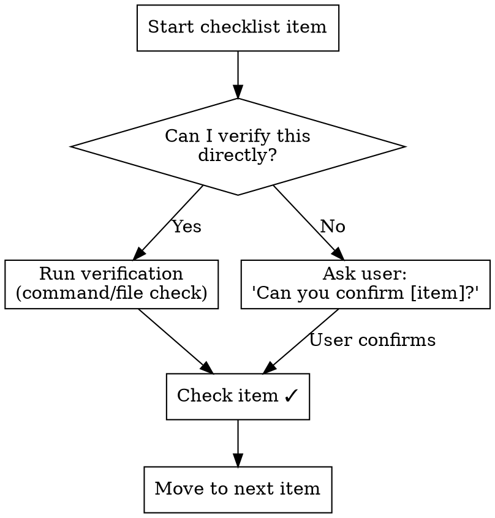
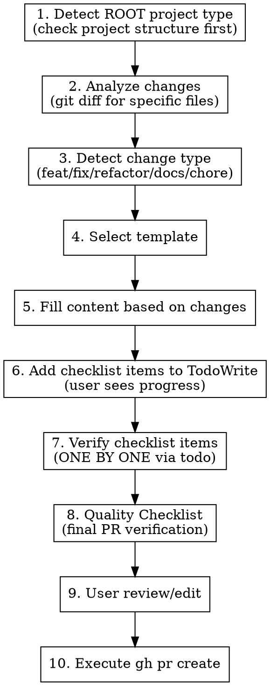
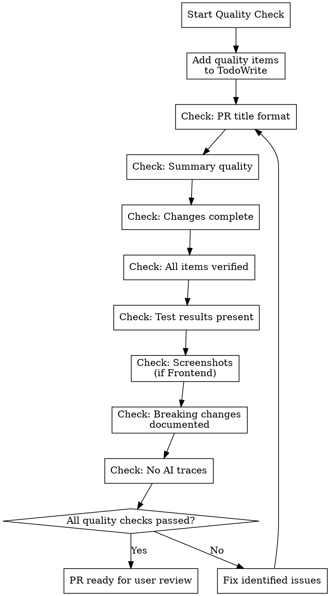

# Create PR

## Overview

**Checks root project structure FIRST**, then analyzes changes to generate team-standard PRs. Uses **TodoWrite for checklist tracking** so users can see verification progress in real-time. Includes **Quality Checklist** for final PR verification. **Final PR content is generated in Korean**, while this skill document and instructions remain in English.

## When to Use

- When creating a PR
- Before running `gh pr create` to structure PR content

## Critical Rule: Step-by-Step Checklist Verification

**IMPORTANT:** You MUST process checklist items ONE BY ONE, not all at once.

For each checklist item:
1. **Attempt to verify** - Run commands, check files, or inspect code
2. **If verifiable** - Check the item and move to next
3. **If NOT verifiable** - Ask the user for confirmation before proceeding



### Verifiable vs Non-Verifiable Items

| Verifiable (Auto-check) | Non-Verifiable (Ask User) |
|------------------------|---------------------------|
| Lint passes (`ruff check`, `pnpm lint`) | UI looks correct (screenshots needed) |
| Build succeeds (`pnpm build`) | Dark mode support visually confirmed |
| File exists | Accessibility manually tested |
| Type errors (`tsc --noEmit`) | Breaking change impact assessed |
| Tests pass (`pytest`, etc.) | Backward compatibility with clients |
| Required files created | Performance acceptable |
| Registered in config files | Mobile/responsive design verified |

### Example Verification Flow

```
Checklist item: "Pydantic Request/Response schema defined"
→ I can check: Search for schema files in the diff
→ Action: Run `git diff --name-only | grep schemas`
→ Result: Found `schemas/rag.py` ✓

Checklist item: "Dark mode support confirmed"
→ I cannot verify this visually
→ Action: Ask user "Can you confirm dark mode works correctly?"
→ Wait for user response before checking
```

## Workflow



## Step 1: Detect ROOT Project Type First

**IMPORTANT:** Check the project structure FIRST, not just the changed files.

```bash
# Check root project structure
ls -la

# Check for key project indicators
ls package.json 2>/dev/null && echo "Frontend/Node project detected"
ls pyproject.toml 2>/dev/null && echo "Python project detected"
ls langgraph.json 2>/dev/null && echo "LangGraph/Agent project detected"
ls backend/ 2>/dev/null && echo "Backend directory exists"
ls frontend/ 2>/dev/null && echo "Frontend directory exists"
ls agent/ 2>/dev/null && echo "Agent directory exists"
```

### Root Project Type Priority

| Project Indicator | Root Type |
|-------------------|-----------|
| `backend/` + `frontend/` directories | Full-stack (check changes for specific type) |
| Only `pyproject.toml` + `backend/` | Backend |
| Only `package.json` + `frontend/` | Frontend |
| `langgraph.json` at root | Agent |
| `backend/langgraph.json` | MCP Server |

After determining root project type, THEN analyze changes to narrow down the specific area.

## Project Detection Rules

| Changed File Path | Project Type | Description |
|-------------------|--------------|-------------|
| `backend/interface/api/endpoints/**` | Backend | API endpoints |
| `backend/interface/api/schemas/**` | Backend | Pydantic schemas |
| `backend/interface/api/routers/**` | Backend | Router config |
| `backend/infrastructure/**` | Backend | DB, logging infrastructure |
| `backend/config/**` | Backend | Config files |
| `frontend/src/**` | Frontend | Frontend source |
| `frontend/components/**` | Frontend | React components |
| `backend/domain/rag/**` | MCP Server | LangGraph RAG implementation |
| `backend/langgraph.json` | MCP Server | LangGraph config |
| `agent/**/*.py` | Agent | Agent implementation |
| `langgraph.json` (root) | Agent | Agent registration |

### Multi-Project Change Priority

When changes span multiple projects, use this priority:

1. **API layer changes present** → Backend
2. **Only LangGraph files changed** → MCP Server
3. **Only Agent files changed** → Agent
4. **Only Frontend files changed** → Frontend

### Note: RAG File Distinction

- `backend/interface/api/endpoints/rag.py` → **Backend** (API layer)
- `backend/domain/rag/**` → **MCP Server** (LangGraph implementation)

## Change Type Detection

| Keyword/Pattern | Change Type |
|-----------------|-------------|
| New file + major feature | feat |
| Existing file + bug/error related | fix |
| Structure change, rename | refactor |
| Only `.md` files changed | docs |
| Only config, dependencies | chore |

## Templates

Project-specific templates (output in Korean):
- [backend-pr-template.md](backend-pr-template.md)
- [frontend-pr-template.md](frontend-pr-template.md)
- [mcp-server-pr-template.md](mcp-server-pr-template.md)
- [agent-pr-template.md](agent-pr-template.md)

## Execution Steps

### Step 1: Analyze Changes

```bash
# List changed files
git diff --name-only main...HEAD

# Change statistics
git diff --stat main...HEAD

# Commit history
git log --oneline main...HEAD
```

### Step 2: Determine Project/Change Type

Examine changed file paths and determine based on tables above.

```bash
# Check Backend files
git diff --name-only main...HEAD | grep -E '^backend/interface/api/'

# Check MCP Server files
git diff --name-only main...HEAD | grep -E '^backend/domain/rag/'

# Check Agent files
git diff --name-only main...HEAD | grep -E '^agent/'

# Check Frontend files
git diff --name-only main...HEAD | grep -E '^frontend/'
```

For multi-project changes, follow **Multi-Project Priority**.

### Step 3: Fill Template

1. **PR Type** - Select checkbox
2. **Changes** - Summarize based on git diff
3. **Modified Files** - List main files
4. **Checklist** - Keep only relevant items for this type
5. **Test Results** - Commands executed and results

### Step 4: Add Checklist Items to TodoWrite

**CRITICAL: Use TodoWrite to track checklist progress so users can see verification status.**

Before verifying, add ALL checklist items as todos:

```
Example TodoWrite call:
todos: [
  {"content": "Verify: Ruff lint passes", "status": "pending", "activeForm": "Verifying Ruff lint"},
  {"content": "Verify: Type check passes", "status": "pending", "activeForm": "Verifying type check"},
  {"content": "Verify: Tests pass", "status": "pending", "activeForm": "Verifying tests"},
  {"content": "Confirm: Dark mode support (user verification)", "status": "pending", "activeForm": "Confirming dark mode support"},
  ...
]
```

### Step 5: Verify Checklist (Step-by-Step via Todo)

**CRITICAL: Process each checklist item individually, updating todo status as you go.**

For each item in the checklist:

1. **Mark todo as in_progress** - Update the todo status
2. **Identify the item** - State which item you're checking
3. **Determine if verifiable** - Can you run a command or check a file?
4. **If YES** - Execute verification and report result
5. **If NO** - Ask user: "이 항목을 확인해 주시겠어요? [item description]"
6. **Wait for confirmation** before proceeding
7. **Mark todo as completed** - Update the todo status

Example flow with TodoWrite:
```
# Step 1: Mark current item as in_progress
TodoWrite: [{"content": "Verify: Ruff lint passes", "status": "in_progress", ...}]

# Step 2: Execute verification
$ uv run ruff check .
→ 결과: ✓ 통과 (에러 0개)

# Step 3: Mark as completed, move to next
TodoWrite: [
  {"content": "Verify: Ruff lint passes", "status": "completed", ...},
  {"content": "Verify: Type check passes", "status": "in_progress", ...}
]
```

This gives users **real-time visibility** into which items are being checked.

### Step 6: Quality Checklist (Final PR Verification)

**IMPORTANT:** Before creating PR, verify ALL quality items. Add these to TodoWrite as well.

```
Quality Checklist todos:
[
  {"content": "Quality: PR title follows format", "status": "pending", "activeForm": "Checking PR title format"},
  {"content": "Quality: Summary is clear and concise", "status": "pending", "activeForm": "Checking PR summary"},
  {"content": "Quality: All checklist items verified", "status": "pending", "activeForm": "Confirming all checklist items"},
  {"content": "Quality: Test results included", "status": "pending", "activeForm": "Confirming test results"},
  {"content": "Quality: No AI traces in content", "status": "pending", "activeForm": "Checking for AI traces"}
]
```

#### Quality Checklist Items

| Category | Check Item | How to Verify |
|----------|------------|---------------|
| **Title** | Follows `{type}: {project} - {description}` format | String pattern check |
| **Title** | Type matches actual changes (feat/fix/refactor/docs/chore) | Compare with git diff analysis |
| **Summary** | Clear and concise (1-3 bullet points) | Read and validate |
| **Summary** | Written in Korean | Language check |
| **Changes** | All modified files listed | Compare with `git diff --name-only` |
| **Changes** | Major changes highlighted | Review diff content |
| **Checklist** | Only relevant items kept | Template comparison |
| **Checklist** | All items verified (completed or user-confirmed) | Todo status check |
| **Tests** | Test commands included | Presence check |
| **Tests** | Test results shown | Presence check |
| **Screenshots** | Included for UI changes (Frontend) | Check if Frontend PR |
| **Breaking Changes** | Documented if any | Review changes for breaking patterns |
| **No AI Traces** | No "Generated by AI" or similar phrases | Content search |

#### Quality Verification Flow



### Step 7: User Review

Show PR content to user and confirm before creating.

## PR Title Format

```
{type}: {project} - {description}
```

Examples:
- `feat: Backend - RAG summary 엔드포인트 추가`
- `fix: Frontend - 다크모드 토글 버그 수정`
- `feat: Agent - Learning Agent 추가`

## Common Mistakes

| Mistake | Solution |
|---------|----------|
| Keep all checklist items | Keep only items relevant to PR type |
| Missing test results | Always include test commands and results |
| Missing screenshots (Frontend) | Before/After required for UI changes |
| Undocumented breaking change | Add section to document it |
| Checking all items at once | Process ONE BY ONE, ask user when needed |
| Not using TodoWrite for checklist | Use TodoWrite for user visibility |
| Detecting project from changes only | Check root project structure FIRST |
| Skipping Quality Checklist | Always run quality checks before user review |

## Red Flags - STOP

- PR type not selected
- Checklist not reviewed item by item
- Tests not executed
- User not asked for non-verifiable items
- AI tool traces in commit messages
- **Root project type not checked before analyzing changes**
- **Checklist items not tracked in TodoWrite**
- **Quality Checklist not verified before creating PR**
