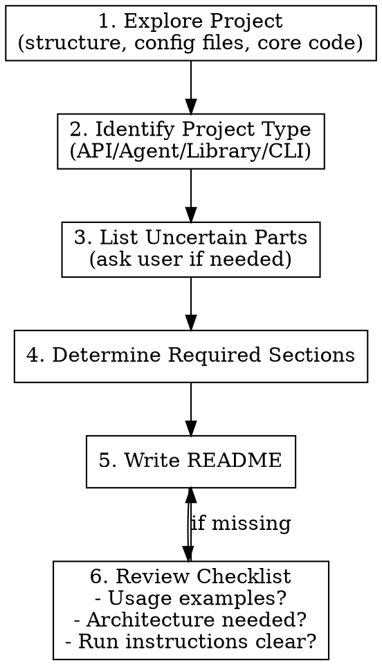

# Generate README

## Overview

A skill that analyzes project folders and automatically generates professional README.md files. Instead of simply listing features, it creates documentation that **helps users understand and immediately use the project**.

## When to Use

- New project README creation request
- Existing README improvement/rewrite request
- Requests like "document this", "create a README", etc.

## Core Principle

**A README should convey "why it's needed and how to use it" rather than just "what it does".**

## Uncertainty Handling (CRITICAL)

**NEVER guess information that cannot be clearly verified from the code.**

### When You MUST Ask the User

| Situation | Example | How to Ask |
|-----------|---------|------------|
| **Functionality unclear from code** | Uncommented modules, ambiguous function names | "What is the main purpose of module X?" |
| **Multiple interpretations possible** | Similarly named components | "Can you explain the difference between A and B?" |
| **Business logic related** | Domain-specific terms, internal rules | "What is the exact meaning of this term/feature?" |
| **Use case unclear** | Who, when, why uses it | "Who are the main users and what are the typical use cases?" |
| **Config value meaning unclear** | Magic numbers, flags | "What does this config value mean and what's the recommended value?" |

### Things You MUST NOT Write Without Confirmation

- **Specific purpose** of each module/component (no guessing)
- Detailed behavior of **business logic**
- Reasons **why** a specific feature is needed
- **Measurement-based claims** like performance metrics, accuracy
- **Comparison of differences** between components

### Confirmation Process

```
1. Analyze code → List uncertain parts
2. Ask user (3-5 questions at a time)
3. Write README after receiving answers
4. Items without answers → TODO or omit
```

### Question Template Example

```
I need to confirm a few things before writing the README:

1. **[Module name]**: What is the main purpose of this module and how does it differ from others?
2. **[Feature name]**: I found [X] in the code, how exactly does it work?
3. **Use cases**: Who are the main users and what are the typical use cases for this project?
```

## Required Sections (Select based on project characteristics)

### 1. Project Introduction
```markdown
# Project Name

One-line description

## Introduction

### Problem
[What pain exists without this project]

### Solution
[How it solves it - core architecture/approach]
```

### 2. Usage Examples (MUST HAVE)
```markdown
## Usage Examples

### [Main Feature 1]

\`\`\`python
# Working code example
from project import main_class

result = main_class.do_something()
\`\`\`

### Conversational Scenario (for Agent/Chatbot)
\`User\`: Request content
\`Agent\`: Response content
```

### 3. Architecture (for complex projects)
```markdown
## Architecture

\`\`\`mermaid
flowchart TD
    A[Input] --> B{Branch}
    B -->|Condition1| C[Process1]
    B -->|Condition2| D[Process2]
\`\`\`
```

### 4. Project Structure
```markdown
## Project Structure

\`\`\`
project/
├── src/           # Core logic
├── tests/         # Tests
└── config/        # Configuration
\`\`\`
```

### 5. Quick Start
```markdown
## Quick Start

### 1. Set Environment Variables
\`\`\`bash
cp .env.example .env
\`\`\`

### 2. Install Dependencies
\`\`\`bash
uv sync  # or npm install
\`\`\`

### 3. Run
\`\`\`bash
uv run langgraph dev
\`\`\`
```

### 6. Environment Variables (Table)
```markdown
## Environment Variables

| Variable | Required | Description |
|----------|----------|-------------|
| `API_KEY` | Yes | API key |
```

### 7. API Endpoints (for backend projects)
```markdown
## API Endpoints

| Endpoint | Method | Description |
|----------|--------|-------------|
| `/api/v1/resource` | POST | Create resource |
```

## Workflow



## Project Type Detection

| Project Type | Detection Criteria | Emphasize Sections |
|--------------|-------------------|-------------------|
| **Agent/Chatbot** | langgraph.json, agent.py, prompts.py | Conversational scenarios, architecture diagram |
| **API Backend** | main.py + FastAPI/Flask, routers/ | API endpoint table, request/response examples |
| **Library/SDK** | pyproject.toml (library), __init__.py exports | Code examples, API Reference |
| **CLI Tool** | argparse, click, typer | Command examples, option descriptions |
| **Frontend** | package.json + React/Vue/Next | Screenshots, component structure |
| **Full Stack** | frontend/ + backend/ | Overall architecture, each layer description |

## Common Mistakes

| Mistake | Solution |
|---------|----------|
| Only listing features | Explain "why it's needed" first |
| No usage examples | At least 1 working code/scenario |
| Skipping architecture | Complex projects need Mermaid diagrams |
| Vague installation | Make it copy-paste executable |
| Missing env vars | Document in .env.example or table |
| **Guessing uncertain info** | Ask user if not confirmed in code |
| **Fabricating module differences** | Must confirm if you don't know exact differences |

## Red Flags - STOP and Fix

- No "Usage Examples" section in README
- Cannot run immediately after installation (unclear commands)
- Complex project without architecture diagram
- Only "what it does" without "why it's needed"
- **About to write feature description not confirmed in code** → STOP, ask user
- **About to guess differences between similar modules** → STOP, ask user
- **About to use speculative expressions like "seems to", "appears to"** → STOP, confirm first

## Quality Checklist

After writing README, verify:

- [ ] Is the project purpose clear within the first 3 lines?
- [ ] Is there at least 1 usage example?
- [ ] Can it be installed/run with copy-paste?
- [ ] Are all environment variables documented?
- [ ] Is complex architecture visualized?
- [ ] **Are all feature descriptions facts verified from code?**
- [ ] **Were uncertain parts confirmed with user?**
